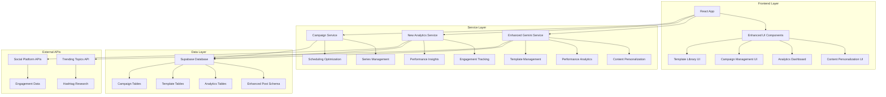

# Design Document

## Overview

This design document outlines the architecture for enhanced social media and content generation features that will extend the existing SoloSuccess AI Content Factory. The enhancements focus on advanced personalization, intelligent automation, performance analytics, and expanded platform integrations while maintaining the current React/TypeScript/Supabase architecture.

## Architecture

### High-Level Architecture

The enhanced features will integrate seamlessly with the existing architecture:



### Component Architecture

The enhanced features will extend the existing single-page application architecture with new modal-based interfaces and enhanced state management:

- **Enhanced App.tsx**: Extended state management for new features
- **New Components**: Analytics dashboard, campaign manager, template library
- **Enhanced Services**: Extended Gemini service, new analytics and campaign services
- **Database Extensions**: New tables for analytics, templates, and campaigns

## Components and Interfaces

### 1. Content Personalization System

#### Brand Voice Manager

```typescript
interface BrandVoice {
  id: string;
  name: string;
  tone: string;
  vocabulary: string[];
  writingStyle: string;
  targetAudience: string;
  sampleContent: string[];
  createdAt: Date;
}

interface PersonalizationSettings {
  brandVoice: BrandVoice;
  defaultTone: string;
  targetAudience: AudienceProfile;
  contentPreferences: ContentPreferences;
}
```

#### Audience Targeting

```typescript
interface AudienceProfile {
  id: string;
  name: string;
  ageRange: string;
  industry: string;
  interests: string[];
  painPoints: string[];
  preferredContentTypes: string[];
  engagementPatterns: EngagementData;
}
```

### 2. Campaign and Series Management

#### Campaign System

```typescript
interface Campaign {
  id: string;
  name: string;
  description: string;
  theme: string;
  startDate: Date;
  endDate: Date;
  posts: string[]; // Post IDs
  platforms: string[];
  status: 'draft' | 'active' | 'completed' | 'paused';
  performance: CampaignMetrics;
}

interface ContentSeries {
  id: string;
  campaignId?: string;
  name: string;
  theme: string;
  totalPosts: number;
  frequency: 'daily' | 'weekly' | 'biweekly';
  currentPost: number;
  posts: SeriesPost[];
}
```

### 3. Enhanced Scheduling System

#### Smart Scheduling Engine

```typescript
interface SchedulingEngine {
  analyzeOptimalTimes(platform: string, audience: AudienceProfile): Promise<TimeSlot[]>;
  preventContentConflicts(posts: Post[]): ConflictAnalysis;
  suggestPostSpacing(posts: Post[], platform: string): SchedulingSuggestion[];
  adjustForTimezones(schedule: Date, targetTimezones: string[]): Date[];
}

interface TimeSlot {
  time: string; // HH:mm format
  dayOfWeek: number; // 0-6
  engagementScore: number;
  confidence: number;
}
```

### 4. Enhanced Image Generation

#### Style Consistency System

```typescript
interface ImageStyle {
  id: string;
  name: string;
  stylePrompt: string;
  colorPalette: string[];
  visualElements: string[];
  brandAssets: BrandAsset[];
}

interface BrandAsset {
  id: string;
  type: 'logo' | 'color' | 'font' | 'pattern';
  data: string;
  usage: 'always' | 'optional' | 'never';
}
```

### 5. Performance Analytics System

#### Analytics Engine

```typescript
interface AnalyticsService {
  trackEngagement(postId: string, platform: string, metrics: EngagementMetrics): Promise<void>;
  generatePerformanceReport(timeframe: string): Promise<PerformanceReport>;
  identifyTopContent(criteria: AnalysisCriteria): Promise<ContentInsight[]>;
  suggestOptimizations(postId: string): Promise<OptimizationSuggestion[]>;
}

interface EngagementMetrics {
  likes: number;
  shares: number;
  comments: number;
  clicks: number;
  impressions: number;
  reach: number;
  timestamp: Date;
}
```

### 6. Template Library System

#### Template Management

```typescript
interface ContentTemplate {
  id: string;
  name: string;
  category: string;
  industry: string;
  contentType: 'blog' | 'social' | 'email' | 'video';
  structure: TemplateSection[];
  customizableFields: TemplateField[];
  usage: number;
  rating: number;
}

interface TemplateSection {
  id: string;
  type: 'heading' | 'paragraph' | 'list' | 'cta' | 'image';
  content: string;
  isCustomizable: boolean;
  placeholder?: string;
}
```

## Data Models

### Enhanced Database Schema

#### Extended Posts Table

```sql
-- Add new columns to existing posts table
ALTER TABLE posts ADD COLUMN brand_voice_id UUID REFERENCES brand_voices(id);
ALTER TABLE posts ADD COLUMN audience_profile_id UUID REFERENCES audience_profiles(id);
ALTER TABLE posts ADD COLUMN campaign_id UUID REFERENCES campaigns(id);
ALTER TABLE posts ADD COLUMN series_id UUID REFERENCES content_series(id);
ALTER TABLE posts ADD COLUMN template_id UUID REFERENCES content_templates(id);
ALTER TABLE posts ADD COLUMN performance_score DECIMAL(3,2);
ALTER TABLE posts ADD COLUMN optimization_suggestions JSONB DEFAULT '[]';
```

#### New Tables

```sql
-- Brand Voices
CREATE TABLE brand_voices (
  id UUID DEFAULT gen_random_uuid() PRIMARY KEY,
  user_id UUID REFERENCES auth.users(id),
  name TEXT NOT NULL,
  tone TEXT NOT NULL,
  vocabulary TEXT[] DEFAULT '{}',
  writing_style TEXT,
  target_audience TEXT,
  sample_content TEXT[] DEFAULT '{}',
  created_at TIMESTAMPTZ DEFAULT NOW()
);

-- Audience Profiles
CREATE TABLE audience_profiles (
  id UUID DEFAULT gen_random_uuid() PRIMARY KEY,
  user_id UUID REFERENCES auth.users(id),
  name TEXT NOT NULL,
  age_range TEXT,
  industry TEXT,
  interests TEXT[] DEFAULT '{}',
  pain_points TEXT[] DEFAULT '{}',
  preferred_content_types TEXT[] DEFAULT '{}',
  engagement_patterns JSONB DEFAULT '{}',
  created_at TIMESTAMPTZ DEFAULT NOW()
);

-- Campaigns
CREATE TABLE campaigns (
  id UUID DEFAULT gen_random_uuid() PRIMARY KEY,
  user_id UUID REFERENCES auth.users(id),
  name TEXT NOT NULL,
  description TEXT,
  theme TEXT,
  start_date TIMESTAMPTZ,
  end_date TIMESTAMPTZ,
  platforms TEXT[] DEFAULT '{}',
  status TEXT CHECK (status IN ('draft', 'active', 'completed', 'paused')) DEFAULT 'draft',
  performance JSONB DEFAULT '{}',
  created_at TIMESTAMPTZ DEFAULT NOW()
);

-- Content Series
CREATE TABLE content_series (
  id UUID DEFAULT gen_random_uuid() PRIMARY KEY,
  user_id UUID REFERENCES auth.users(id),
  campaign_id UUID REFERENCES campaigns(id),
  name TEXT NOT NULL,
  theme TEXT,
  total_posts INTEGER,
  frequency TEXT CHECK (frequency IN ('daily', 'weekly', 'biweekly')),
  current_post INTEGER DEFAULT 0,
  created_at TIMESTAMPTZ DEFAULT NOW()
);

-- Analytics Data
CREATE TABLE post_analytics (
  id UUID DEFAULT gen_random_uuid() PRIMARY KEY,
  post_id UUID REFERENCES posts(id),
  platform TEXT NOT NULL,
  likes INTEGER DEFAULT 0,
  shares INTEGER DEFAULT 0,
  comments INTEGER DEFAULT 0,
  clicks INTEGER DEFAULT 0,
  impressions INTEGER DEFAULT 0,
  reach INTEGER DEFAULT 0,
  recorded_at TIMESTAMPTZ DEFAULT NOW()
);

-- Content Templates
CREATE TABLE content_templates (
  id UUID DEFAULT gen_random_uuid() PRIMARY KEY,
  user_id UUID REFERENCES auth.users(id),
  name TEXT NOT NULL,
  category TEXT,
  industry TEXT,
  content_type TEXT CHECK (content_type IN ('blog', 'social', 'email', 'video')),
  structure JSONB NOT NULL,
  customizable_fields JSONB DEFAULT '[]',
  usage_count INTEGER DEFAULT 0,
  rating DECIMAL(2,1) DEFAULT 0,
  is_public BOOLEAN DEFAULT false,
  created_at TIMESTAMPTZ DEFAULT NOW()
);

-- Image Styles
CREATE TABLE image_styles (
  id UUID DEFAULT gen_random_uuid() PRIMARY KEY,
  user_id UUID REFERENCES auth.users(id),
  name TEXT NOT NULL,
  style_prompt TEXT NOT NULL,
  color_palette TEXT[] DEFAULT '{}',
  visual_elements TEXT[] DEFAULT '{}',
  brand_assets JSONB DEFAULT '[]',
  created_at TIMESTAMPTZ DEFAULT NOW()
);
```

## Error Handling

### Enhanced Error Management

#### Service-Level Error Handling

```typescript
class EnhancedError extends Error {
  constructor(
    message: string,
    public code: string,
    public context?: any,
    public suggestions?: string[]
  ) {
    super(message);
    this.name = 'EnhancedError';
  }
}

interface ErrorHandler {
  handleAnalyticsError(error: Error): UserFriendlyError;
  handleCampaignError(error: Error): UserFriendlyError;
  handleTemplateError(error: Error): UserFriendlyError;
  handleSchedulingError(error: Error): UserFriendlyError;
}
```

#### User Experience Error Handling

- **Graceful Degradation**: If analytics fail, core functionality remains available
- **Retry Mechanisms**: Automatic retry for transient failures
- **Fallback Options**: Alternative suggestions when primary features fail
- **Progress Preservation**: Save user work during errors

## Testing Strategy

### Unit Testing

- **Service Layer**: Test all new services with mock data
- **Component Testing**: Test new UI components in isolation
- **Utility Functions**: Test analytics calculations and scheduling algorithms

### Integration Testing

- **Database Operations**: Test new table operations and relationships
- **API Integrations**: Test external service integrations
- **Workflow Testing**: Test complete user workflows for new features

### Performance Testing

- **Analytics Queries**: Ensure database queries perform well with large datasets
- **Image Generation**: Test image generation performance and memory usage
- **Real-time Updates**: Test Supabase real-time performance with enhanced data

### User Acceptance Testing

- **Campaign Creation**: Test complete campaign creation and management workflow
- **Template Usage**: Test template selection, customization, and content generation
- **Analytics Dashboard**: Test analytics viewing and insight generation
- **Scheduling Optimization**: Test smart scheduling recommendations

## Implementation Phases

### Phase 1: Foundation (Core Infrastructure)

1. Database schema extensions
2. Enhanced service layer architecture
3. Basic UI component structure
4. Error handling framework

### Phase 2: Content Personalization

1. Brand voice management system
2. Audience profile creation
3. Content tone and style customization
4. Template library foundation

### Phase 3: Campaign Management

1. Campaign creation and management
2. Content series functionality
3. Enhanced scheduling system
4. Performance tracking integration

### Phase 4: Analytics and Optimization

1. Analytics dashboard
2. Performance insights engine
3. Optimization suggestions
4. Reporting system

### Phase 5: Advanced Features

1. External integrations
2. Collaboration features
3. Advanced image generation
4. Hashtag research and trending topics

## Security Considerations

### Data Privacy

- **User Data Isolation**: Ensure all new features respect existing RLS policies
- **Analytics Privacy**: Anonymize sensitive analytics data
- **Template Sharing**: Secure template sharing with proper permissions

### API Security

- **Rate Limiting**: Implement rate limiting for new AI service calls
- **Input Validation**: Validate all user inputs for new features
- **External API Security**: Secure integration with social platform APIs

### Performance Security

- **Resource Limits**: Prevent abuse of analytics and generation features
- **Database Security**: Ensure new queries don't expose unauthorized data
- **Caching Strategy**: Implement secure caching for performance optimization
