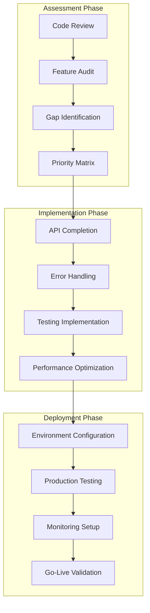

# Design Document

## Overview

This design document outlines the comprehensive approach to ensure the SoloSuccess AI Content Factory is production-ready. Based on the codebase analysis, the application has extensive functionality implemented but requires systematic validation, gap identification, and production hardening to ensure all features work reliably in a deployed environment.

## Architecture

### Current State Analysis

The application currently has:

- **Frontend**: React 18.3.1 with TypeScript, comprehensive UI components
- **Backend**: Vercel serverless functions with API endpoints
- **Database**: Neon PostgreSQL with comprehensive schema
- **AI Services**: Google Gemini AI integration for content generation
- **Authentication**: Stack Auth integration
- **Enhanced Features**: Brand voices, campaigns, analytics, templates, integrations

### Production Readiness Strategy



## Components and Interfaces

### 1. API Endpoint Validation System

#### Missing API Endpoints Analysis

Based on the codebase review, several API endpoints need implementation or validation:

```typescript
interface APIGapAnalysis {
  implemented: string[];
  missing: string[];
  incomplete: string[];
  needsValidation: string[];
}

interface ProductionAPIRequirements {
  authentication: AuthEndpoints;
  contentManagement: ContentEndpoints;
  enhancedFeatures: EnhancedEndpoints;
  integrations: IntegrationEndpoints;
  analytics: AnalyticsEndpoints;
}
```

### 2. Error Handling Framework

#### Comprehensive Error Management

```typescript
interface ProductionErrorHandler {
  apiErrors: APIErrorHandler;
  databaseErrors: DatabaseErrorHandler;
  aiServiceErrors: AIServiceErrorHandler;
  integrationErrors: IntegrationErrorHandler;
  userFacingErrors: UserErrorHandler;
}

interface ErrorRecoveryStrategy {
  retryMechanisms: RetryConfig;
  fallbackOptions: FallbackConfig;
  gracefulDegradation: DegradationConfig;
  userNotification: NotificationConfig;
}
```

### 3. Testing Infrastructure

#### Test Coverage Strategy

```typescript
interface TestingFramework {
  unitTests: UnitTestConfig;
  integrationTests: IntegrationTestConfig;
  endToEndTests: E2ETestConfig;
  performanceTests: PerformanceTestConfig;
  securityTests: SecurityTestConfig;
}
```

### 4. Performance Optimization System

#### Performance Monitoring and Optimization

```typescript
interface PerformanceOptimization {
  databaseOptimization: DatabaseOptimizationConfig;
  apiOptimization: APIOptimizationConfig;
  frontendOptimization: FrontendOptimizationConfig;
  caching: CachingStrategy;
  monitoring: MonitoringConfig;
}
```

## Data Models

### Production Configuration Schema

#### Environment Configuration

```typescript
interface ProductionEnvironment {
  database: DatabaseConfig;
  aiServices: AIServiceConfig;
  authentication: AuthConfig;
  integrations: IntegrationConfig;
  monitoring: MonitoringConfig;
  security: SecurityConfig;
}
```

#### Deployment Configuration

```typescript
interface DeploymentConfig {
  vercel: VercelConfig;
  environment: EnvironmentVariables;
  buildSettings: BuildConfig;
  serverlessConfig: ServerlessConfig;
}
```

## Error Handling

### Production Error Management Strategy

#### Error Classification System

```typescript
enum ErrorSeverity {
  CRITICAL = 'critical', // System unusable
  HIGH = 'high', // Major functionality broken
  MEDIUM = 'medium', // Some features affected
  LOW = 'low', // Minor issues
}

interface ErrorHandlingStrategy {
  detection: ErrorDetectionConfig;
  logging: ErrorLoggingConfig;
  notification: ErrorNotificationConfig;
  recovery: ErrorRecoveryConfig;
  userExperience: UserErrorExperienceConfig;
}
```

#### Recovery Mechanisms

- **Automatic Retry**: Exponential backoff for transient failures
- **Circuit Breaker**: Prevent cascade failures in integrations
- **Graceful Degradation**: Core functionality remains available
- **Fallback Services**: Alternative implementations for critical features

## Testing Strategy

### Comprehensive Testing Approach

#### Test Categories

1. **Unit Tests**: Individual function and component testing
2. **Integration Tests**: API endpoint and database operation testing
3. **End-to-End Tests**: Complete user workflow testing
4. **Performance Tests**: Load and stress testing
5. **Security Tests**: Authentication and authorization testing

#### Test Implementation Plan

```typescript
interface TestImplementationPlan {
  phase1: CoreFunctionalityTests;
  phase2: EnhancedFeatureTests;
  phase3: IntegrationTests;
  phase4: PerformanceTests;
  phase5: SecurityTests;
}
```

## Implementation Phases

### Phase 1: Core System Validation (Priority: Critical)

1. **API Endpoint Audit**: Verify all endpoints work correctly
2. **Database Operations**: Validate all CRUD operations
3. **Authentication Flow**: Ensure secure user management
4. **Basic Error Handling**: Implement fundamental error management

### Phase 2: Enhanced Features Validation (Priority: High)

1. **AI Content Generation**: Verify all AI services work correctly
2. **Brand Voice & Personalization**: Validate personalization features
3. **Campaign Management**: Ensure campaign functionality works
4. **Analytics System**: Verify data collection and reporting

### Phase 3: Integration & External Services (Priority: High)

1. **Social Media Integrations**: Validate external API connections
2. **Webhook Management**: Ensure webhook processing works
3. **Third-party Services**: Verify all external service integrations
4. **Data Synchronization**: Validate data sync processes

### Phase 4: Performance & Optimization (Priority: Medium)

1. **Database Performance**: Optimize queries and indexing
2. **API Response Times**: Ensure acceptable performance
3. **Frontend Optimization**: Optimize loading and rendering
4. **Caching Implementation**: Add appropriate caching layers

### Phase 5: Production Deployment (Priority: Critical)

1. **Environment Configuration**: Set up production environment
2. **Deployment Pipeline**: Configure automated deployment
3. **Monitoring Setup**: Implement production monitoring
4. **Security Hardening**: Apply production security measures

## Security Considerations

### Production Security Requirements

#### Authentication & Authorization

- **Secure Session Management**: Proper token handling and expiration
- **Role-Based Access Control**: Appropriate permission levels
- **API Security**: Rate limiting and input validation
- **Data Encryption**: Sensitive data protection

#### Data Protection

- **Database Security**: Connection encryption and access controls
- **API Key Management**: Secure storage and rotation
- **User Data Privacy**: GDPR compliance and data handling
- **Integration Security**: Secure credential storage

## Monitoring and Observability

### Production Monitoring Strategy

#### Key Metrics

- **Application Performance**: Response times, error rates
- **Database Performance**: Query performance, connection health
- **AI Service Usage**: API usage, rate limits, costs
- **User Experience**: Page load times, error rates
- **Integration Health**: External service availability

#### Alerting Strategy

- **Critical Alerts**: System down, database unavailable
- **Warning Alerts**: High error rates, performance degradation
- **Info Alerts**: Unusual usage patterns, capacity warnings

## Deployment Configuration

### Vercel Production Setup

#### Required Configuration

```typescript
interface VercelProductionConfig {
  environmentVariables: ProductionEnvironmentVariables;
  buildSettings: VercelBuildConfig;
  serverlessConfig: VercelServerlessConfig;
  domainConfig: DomainConfiguration;
  securityHeaders: SecurityHeaderConfig;
}
```

#### Environment Variables Validation

- **Database Connection**: Verify Neon PostgreSQL connection
- **AI Service Keys**: Validate Google Gemini API access
- **Authentication**: Confirm Stack Auth configuration
- **Integration Keys**: Verify all external service credentials

## Quality Assurance

### Production Readiness Checklist

#### Functional Requirements

- [ ] All API endpoints respond correctly
- [ ] Database operations work reliably
- [ ] Authentication flow functions properly
- [ ] AI content generation works consistently
- [ ] Enhanced features operate correctly
- [ ] Integration services connect successfully

#### Non-Functional Requirements

- [ ] Performance meets acceptable standards
- [ ] Error handling covers all scenarios
- [ ] Security measures are implemented
- [ ] Monitoring and alerting are configured
- [ ] Documentation is complete and accurate
- [ ] Deployment process is automated and reliable

## Success Criteria

### Production Readiness Validation

#### Technical Criteria

- **Functionality**: 100% of features work as designed
- **Performance**: API responses under 2 seconds
- **Reliability**: 99.9% uptime target
- **Security**: All security requirements met
- **Scalability**: Handles expected user load

#### User Experience Criteria

- **Usability**: Intuitive and error-free user experience
- **Responsiveness**: Fast loading and interaction times
- **Reliability**: Consistent functionality across all features
- **Error Handling**: Clear and helpful error messages
- **Data Integrity**: No data loss or corruption

## Risk Assessment

### High-Risk Areas Identified

#### 1. API Endpoint Completeness

- **Risk**: Some API endpoints may be incomplete or missing
- **Impact**: Frontend functionality may fail in production
- **Mitigation**: Comprehensive API testing and validation

#### 2. Database Connection Reliability

- **Risk**: Database connections may fail under load
- **Impact**: Data operations could fail, affecting user experience
- **Mitigation**: Connection pooling, retry mechanisms, monitoring

#### 3. AI Service Dependencies

- **Risk**: External AI services may have rate limits or outages
- **Impact**: Content generation features could become unavailable
- **Mitigation**: Error handling, fallback options, usage monitoring

#### 4. Integration Service Reliability

- **Risk**: External integrations may fail or change APIs
- **Impact**: Social media posting and data sync could fail
- **Mitigation**: Robust error handling, webhook validation, service monitoring

#### 5. Authentication System Stability

- **Risk**: Authentication service issues could lock out users
- **Impact**: Users unable to access the application
- **Mitigation**: Fallback authentication, session management, monitoring

### Medium-Risk Areas

#### 1. Performance Under Load

- **Risk**: Application may slow down with increased usage
- **Impact**: Poor user experience, potential timeouts
- **Mitigation**: Performance testing, optimization, caching

#### 2. Error Handling Coverage

- **Risk**: Unhandled errors could crash the application
- **Impact**: Poor user experience, data loss potential
- **Mitigation**: Comprehensive error handling, logging, monitoring

#### 3. Data Migration and Integrity

- **Risk**: Data corruption during updates or migrations
- **Impact**: Loss of user data, application instability
- **Mitigation**: Backup strategies, transaction management, validation

## Implementation Timeline

### Phase 1: Critical Issues (Week 1-2)

- API endpoint validation and completion
- Database connection stability
- Authentication system verification
- Basic error handling implementation

### Phase 2: Core Features (Week 2-3)

- AI service integration validation
- Enhanced features testing
- Integration service verification
- Performance baseline establishment

### Phase 3: Production Hardening (Week 3-4)

- Comprehensive error handling
- Security implementation
- Monitoring and alerting setup
- Performance optimization

### Phase 4: Deployment and Validation (Week 4-5)

- Production environment setup
- Deployment pipeline configuration
- End-to-end testing in production
- Go-live preparation and validation

## Maintenance and Support

### Post-Production Support Strategy

#### Monitoring and Alerting

- **Real-time Monitoring**: Application health, performance metrics
- **Automated Alerts**: Critical issues, performance degradation
- **Dashboard Setup**: Visual monitoring of key metrics
- **Log Analysis**: Centralized logging and analysis

#### Maintenance Procedures

- **Regular Updates**: Security patches, dependency updates
- **Performance Reviews**: Regular performance analysis and optimization
- **Backup Procedures**: Regular data backups and recovery testing
- **Documentation Updates**: Keep documentation current with changes

#### Support Escalation

- **Level 1**: Basic user support and common issues
- **Level 2**: Technical issues and feature problems
- **Level 3**: Critical system issues and emergency response
- **Development Team**: Complex bugs and feature enhancements

This comprehensive design ensures that the SoloSuccess AI Content Factory will be production-ready with all features fully functional, properly tested, and reliably deployed.
